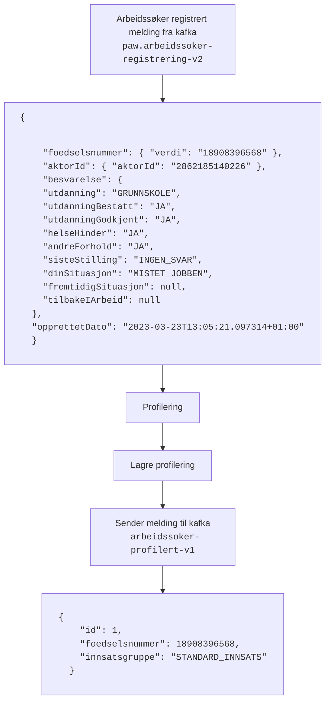

# paw-arbeidssoker-profilering

Profilering av arbeidssøker for å fatte et 14a-vedtak

## Dokumentasjon

https://arbeidssoker-profilering.intern.dev.nav.no/docs

## Flydiagram



## Teknologier

Øvrige teknologier, rammeverk og biblioteker som er blitt tatt i bruk:

- [**Kotlin**](https://kotlinlang.org/)
- [**Ktor**](https://ktor.io/)
- [**Koin**](https://insert-koin.io/)
- [**PostgreSQL**](https://www.postgresql.org/)
- [**Flyway**](https://flywaydb.org/)
- [**Gradle**](https://gradle.org/)


## Lokalt oppsett

Under er det satt opp et par ting som må på plass for at applikasjonen og databasen skal fungere.

### JDK 17

JDK 17 må være installert. Enkleste måten å installere riktig versjon av Java er ved å
bruke [sdkman](https://sdkman.io/install).

### Docker

`docker` og `docker-compose` må være installert. For å
installere disse kan du følge oppskriften på [Dockers](https://www.docker.com/) offisielle side. For installering på Mac
trykk [her](https://docs.docker.com/desktop/mac/install/) eller
trykk [her](https://docs.docker.com/engine/install/ubuntu/) for Ubuntu.

Man må også installere `docker-compose` som en separat greie
for [Ubuntu](https://docs.docker.com/compose/install/#install-compose-on-linux-systems). For Mac følger dette med når
man installerer Docker Desktop.

Kjør opp docker containerne med

```sh
docker-compose up -d
```

Se at alle kjører med
```sh
docker ps
```

Fire containere skal kjøre; kakfa, zookeeper, postgres og mock-oauth2-server.

### Miljøvariabler

Miljøvariabler må være satt opp i `.env`

```sh
cp .env-example .env
```

### App

Start app med `./gradlew run` eller start via intellij

### Autentisering

For å kalle APIet lokalt må man være autentisert med et Bearer token.

Vi benytter mock-ouath2-server til å utstede tokens på lokal maskin. Følgende steg kan benyttes til å generere opp et token:

1. Sørg for at containeren for mock-oauth2-server kjører lokalt (docker-compose up -d)
2. Naviger til [mock-oauth2-server sin side for debugging av tokens](http://localhost:8081/default/debugger)
3. Generer et token
4. Trykk på knappen Get a token
5. Skriv inn noe random i "Enter any user/subject" og pid i optional claims, f.eks.

```json
{ "acr": "Level3", "pid": "26118611111" }
```

6. Trykk Sign in
7. Kopier verdien for access_token og benytt denne som Bearer i Authorization-header

8. Eksempel:

$ curl localhost:8080/api/v1/profilering -H 'Authorization: Bearer <access_token>'

## Kafka

### Producer

Send inn en kafka-melding til `arbeidssoker-registrering-v2`:

```sh
# Eksempel melding
cat src/main/resources/arbeidssoker-registrert-kafka-melding.json | jq -c .
docker exec -it paw-arbeidssoker-profilering_kafka_1 kafka-console-producer.sh --broker-list 127.0.0.1:9092 --topic arbeidssoker-registrering-v2
```

### Consumer

Consumer meldinger fra `arbeidssoker-profilert-v1`

```sh
docker exec -it paw-arbeidssoker-profilering_kafka_1 kafka-console-consumer.sh --bootstrap-server 127.0.0.1:9092 --topic arbeidssoker-profilert-v1
```

## Formatering

Prosjektet bruker kotlinter

Kjør `./gradlew formatKotlin` for autoformatering eller `./gradlew lintKotlin` for å se lint-feil.

## Deploye kun til dev

Ved å prefikse branch-navn med `dev/`, så vil branchen kun deployes i dev.

```
git checkout -b dev/<navn på branch>
```

evt. rename branch

```
git checkout <opprinnlig-branch>
git branch -m dev/<opprinnlig-branch>
```

# Henvendelser

Spørsmål knyttet til koden eller prosjektet kan stilles via issues her på github.

## For NAV-ansatte

Interne henvendelser kan sendes via Slack i kanalen [#team-paw-dev](https://nav-it.slack.com/archives/CLTFAEW75)

# Lisens

[MIT](LICENSE)
