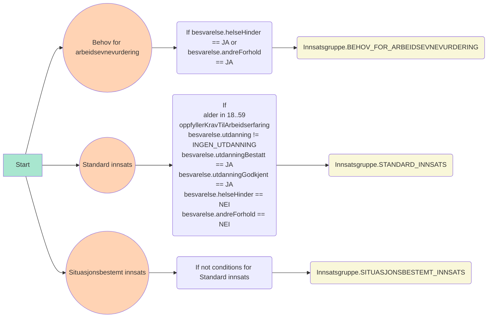

# paw-arbeidssoker-profilering

Profilering av arbeidssøker for å fatte et 14a-vedtak

## Dokumentasjon

https://arbeidssoker-profilering.intern.dev.nav.no/docs

## Flydiagram

```mermaid
graph TD
    ARBEIDSOKER_REGISTRERT["Arbeidssøker registrert"]

    ARBEIDSSOKER_REGISTRERT_MELDING["Sender arbeidssøker registrert melding til kafka"]

    ARBEIDSSOKER_REGISTRERT_KAFKA_MELDING["
    <center><code>topic: paw.arbeidssoker-registrering-v2</code></center>
<pre>
{
    &quot;foedselsnummer&quot;: { &quot;verdi&quot;: &quot;18908396568&quot; },
    &quot;aktorId&quot;: { &quot;aktorId&quot;: &quot;2862185140226&quot; },
    &quot;besvarelse&quot;: {
    &quot;utdanning&quot;: &quot;GRUNNSKOLE&quot;,
    &quot;utdanningBestatt&quot;: &quot;JA&quot;,
    &quot;utdanningGodkjent&quot;: &quot;JA&quot;,
    &quot;helseHinder&quot;: &quot;JA&quot;,
    &quot;andreForhold&quot;: &quot;JA&quot;,
    &quot;sisteStilling&quot;: &quot;INGEN_SVAR&quot;,
    &quot;dinSituasjon&quot;: &quot;MISTET_JOBBEN&quot;,
    &quot;fremtidigSituasjon&quot;: null,
    &quot;tilbakeIArbeid&quot;: null
  },
  &quot;opprettetDato&quot;: &quot;2023-03-23T13:05:21.097314+01:00&quot;
}
</pre>"]

  HENT_ARBEIDSSOKER_REGISTRERING["Henter arbeidssøker registrert melding"]

  PROFILERING["Profilering"]

  LAGRE_PROFILERING["Lagre profilering"]

  ARBEIDSSOKER_PROFILERT_MELDING["Sender profilert melding til kafka"]

  ARBEIDSSOKER_PROFILERT_MELDING_KAFKA["
<center><code>topic: paw.arbeidssoker-profilert-v1</code></center>
<pre>
{
    &quot;id&quot;: 1,
    &quot;foedselsnummer&quot;: 18908396568,
    &quot;innsatsgruppe&quot;: &quot;STANDARD_INNSATS&quot;
}
</pre>"]

subgraph <b>veilarbregistrering</b>
ARBEIDSOKER_REGISTRERT-->ARBEIDSSOKER_REGISTRERT_MELDING
end

subgraph <b>Kafka</b>
ARBEIDSSOKER_REGISTRERT_MELDING-->ARBEIDSSOKER_REGISTRERT_KAFKA_MELDING
end

ARBEIDSSOKER_REGISTRERT_KAFKA_MELDING-->HENT_ARBEIDSSOKER_REGISTRERING

subgraph <b>paw-arbeidssoker-profilering</b>
HENT_ARBEIDSSOKER_REGISTRERING-->PROFILERING
PROFILERING-->LAGRE_PROFILERING
LAGRE_PROFILERING-->ARBEIDSSOKER_PROFILERT_MELDING
end

subgraph <b>Kafka</b>
ARBEIDSSOKER_PROFILERT_MELDING-->ARBEIDSSOKER_PROFILERT_MELDING_KAFKA
end


style ARBEIDSSOKER_REGISTRERT_KAFKA_MELDING text-align:left
style ARBEIDSSOKER_PROFILERT_MELDING_KAFKA text-align:left
```

## Flytdiagram av beregn innsatsgruppe



## Teknologier

Øvrige teknologier, rammeverk og biblioteker som er blitt tatt i bruk:

- [**Kotlin**](https://kotlinlang.org/)
- [**Ktor**](https://ktor.io/)
- [**Koin**](https://insert-koin.io/)
- [**PostgreSQL**](https://www.postgresql.org/)
- [**Flyway**](https://flywaydb.org/)
- [**Gradle**](https://gradle.org/)

## Lokalt oppsett

Under er det satt opp et par ting som må på plass for at applikasjonen og databasen skal fungere.

### JDK 17

JDK 17 må være installert. Enkleste måten å installere riktig versjon av Java er ved å
bruke [sdkman](https://sdkman.io/install).

### Docker

`docker` og `docker-compose` må være installert. For å
installere disse kan du følge oppskriften på [Dockers](https://www.docker.com/) offisielle side. For installering på Mac
trykk [her](https://docs.docker.com/desktop/mac/install/) eller
trykk [her](https://docs.docker.com/engine/install/ubuntu/) for Ubuntu.

Man må også installere `docker-compose` som en separat greie
for [Ubuntu](https://docs.docker.com/compose/install/#install-compose-on-linux-systems). For Mac følger dette med når
man installerer Docker Desktop.

Kjør opp docker containerne med

```sh
docker-compose up -d
```

Se at alle kjører med

```sh
docker ps
```

Fire containere skal kjøre; kakfa, zookeeper, postgres og mock-oauth2-server.

### Miljøvariabler

Miljøvariabler må være satt opp i `.env`

```sh
cp .env-example .env
```

### App

Start app med `./gradlew run` eller start via intellij

### Autentisering

For å kalle APIet lokalt må man være autentisert med et Bearer token.

Vi benytter mock-ouath2-server til å utstede tokens på lokal maskin. Følgende steg kan benyttes til å generere opp et token:

1. Sørg for at containeren for mock-oauth2-server kjører lokalt (docker-compose up -d)
2. Naviger til [mock-oauth2-server sin side for debugging av tokens](http://localhost:8081/default/debugger)
3. Generer et token
4. Trykk på knappen Get a token
5. Skriv inn noe random i "Enter any user/subject" og pid i optional claims, f.eks.

```json
{ "acr": "Level3", "pid": "26118611111" }
```

6. Trykk Sign in
7. Kopier verdien for access_token og benytt denne som Bearer i Authorization-header

8. Eksempel:

```sh
$ curl localhost:8080/api/v1/profilering -H 'Authorization: Bearer <access_token>'
```

eller benytt en REST-klient (f.eks. [insomnia](https://insomnia.rest/) eller [Postman](https://www.postman.com/product/rest-client/)

## Kafka

### Producer

Send inn en kafka-melding til `arbeidssoker-registrering-v2`:

```sh
# Eksempel melding
cat src/main/resources/arbeidssoker-registrert-kafka-melding.json | jq -c .
docker exec -it paw-arbeidssoker-profilering_kafka_1 kafka-console-producer.sh --broker-list 127.0.0.1:9092 --topic arbeidssoker-registrering-v2
```

### Consumer

Consumer meldinger fra `arbeidssoker-profilert-v1`

```sh
docker exec -it paw-arbeidssoker-profilering_kafka_1 kafka-console-consumer.sh --bootstrap-server 127.0.0.1:9092 --topic arbeidssoker-profilert-v1
```

## Formatering

Prosjektet bruker kotlinter

Kjør `./gradlew formatKotlin` for autoformatering eller `./gradlew lintKotlin` for å se lint-feil.

## Deploye kun til dev

Ved å prefikse branch-navn med `dev/`, så vil branchen kun deployes i dev.

```
git checkout -b dev/<navn på branch>
```

evt. rename branch

```
git checkout <opprinnlig-branch>
git branch -m dev/<opprinnlig-branch>
```

# Henvendelser

Spørsmål knyttet til koden eller prosjektet kan stilles via issues her på github.

## For NAV-ansatte

Interne henvendelser kan sendes via Slack i kanalen [#team-paw-dev](https://nav-it.slack.com/archives/CLTFAEW75)

# Lisens

[MIT](LICENSE)
